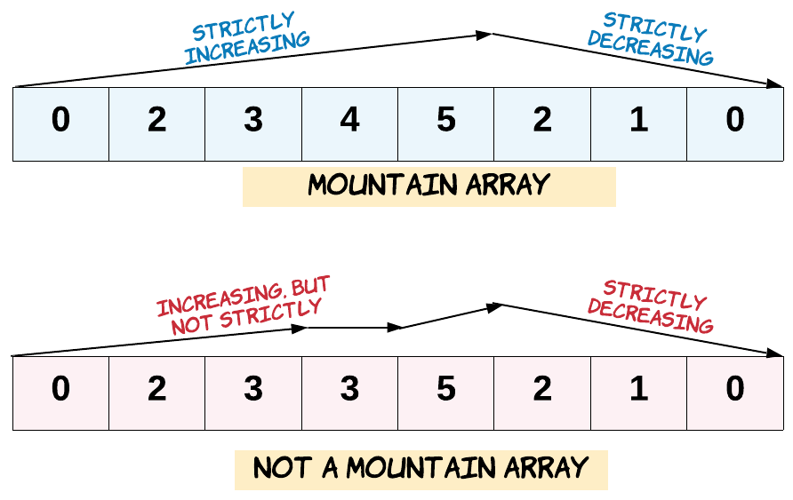

Given an array of integers `arr`, return _`true` if and only if it is a valid mountain array_.

Recall that arr is a mountain array if and only if:

-   `arr.length >= 3`
-   There exists some `i` with `0 < i < arr.length - 1` such that:
    -   `arr[0] < arr[1] < ... < arr[i - 1] < arr[i]`
    -   `arr[i] > arr[i + 1] > ... > arr[arr.length - 1]`



**Example 1:**

```
Input: arr = [2,1]
Output: false

```

**Example 2:**

```
Input: arr = [3,5,5]
Output: false

```

**Example 3:**

```
Input: arr = [0,3,2,1]
Output: true

```

**Constraints:**

-   `1 <= arr.length <= 10^4`
-   `0 <= arr[i] <= 10^4`
