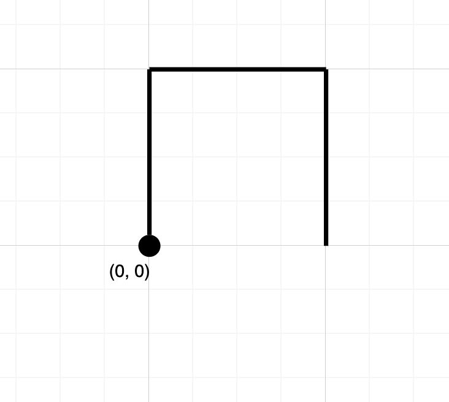

Given a string `path`, where `path[i] = 'N'`, `'S'`, `'E'` or `'W'`, each representing moving one unit north, south, east, or west, respectively. You start at the origin `(0, 0)` on a 2D plane and walk on the path specified by `path`.

Return `true` _if the path crosses itself at any point, that is, if at any time you are on a location you have previously visited_. Return `false` otherwise.

**Example 1:**



```
Input path = "NES"
Output false 
Explanation Notice that the path doesn't cross any point more than once.
```

**Example 2:**


```
Input path = "NESWW"
Output true
Explanation Notice that the path visits the origin twice.
```

**Constraints:**

-   `1 <= path.length <= 10^4`
-   `path[i]` is either `'N'`, `'S'`, `'E'`, or `'W'`.
