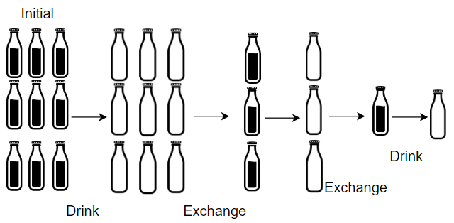
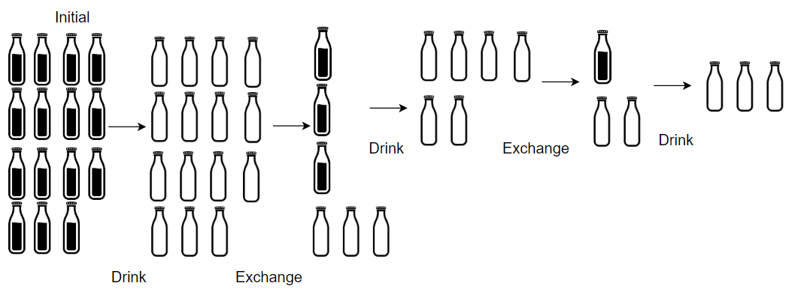

There are `numBottles` water bottles that are initially full of water. You can exchange `numExchange` empty water bottles from the market with one full water bottle.

The operation of drinking a full water bottle turns it into an empty bottle.

Given the two integers `numBottles` and `numExchange`, return _the **maximum** number of water bottles you can drink_.


**Example 1:**



``` Java
Input: numBottles = 9, numExchange = 3
Output: 13
Explanation: You can exchange 3 empty bottles to get 1 full water bottle.
Number of water bottles you can drink: 9 + 3 + 1 = 13.
```


**Example 2:**



``` Java
Input: numBottles = 15, numExchange = 4
Output: 19
Explanation: You can exchange 4 empty bottles to get 1 full water bottle. 
Number of water bottles you can drink: 15 + 3 + 1 = 19.
```

**Constraints:**

-   `1 <= numBottles <= 100`
-   `2 <= numExchange <= 100`
