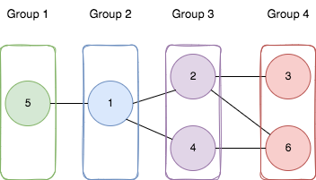

You are given a positive integer `n` representing the number of nodes in an **undirected** graph. The nodes are labeled from `1` to `n`.

You are also given a 2D integer array `edges`, where `edges[i] = [a_i,  b_i]` indicates that there is a **bidirectional** edge between nodes `a_i` and `b_i`. **Notice** that the given graph may be disconnected.

Divide the nodes of the graph into `m` groups (**1-indexed**) such that:

-   Each node in the graph belongs to exactly one group.
-   For every pair of nodes in the graph that are connected by an edge `[a_i,  b_i]`, if `a_i` belongs to the group with index `x`, and `b_i` belongs to the group with index `y`, then `|y - x| = 1`.

Return _the maximum number of groups (i.e., maximum_ `m`_) into which you can divide the nodes_. Return `-1` _if it is impossible to group the nodes with the given conditions_.


**Example 1:**



``` Java
Input: n = 6, edges = [[1,2],[1,4],[1,5],[2,6],[2,3],[4,6]]
Output: 4
Explanation: As shown in the image we:
- Add node 5 to the first group.
- Add node 1 to the second group.
- Add nodes 2 and 4 to the third group.
- Add nodes 3 and 6 to the fourth group.
We can see that every edge is satisfied.
It can be shown that that if we create a fifth group and move any node from the third or fourth group to it, at least on of the edges will not be satisfied.
```


**Example 2:**

``` Java
Input: n = 3, edges = [[1,2],[2,3],[3,1]]
Output: -1
Explanation: If we add node 1 to the first group, node 2 to the second group, and node 3 to the third group to satisfy the first two edges, we can see that the third edge will not be satisfied.
It can be shown that no grouping is possible.
```


**Constraints:**

-   `1 <= n <= 500`
-   `1 <= edges.length <= 10^4`
-   `edges[i].length == 2`
-   `1 <= a_i, b_i <= n`
-   `a_i != b_i`
-   There is at most one edge between any pair of vertices.
