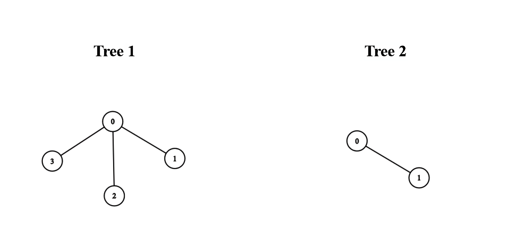
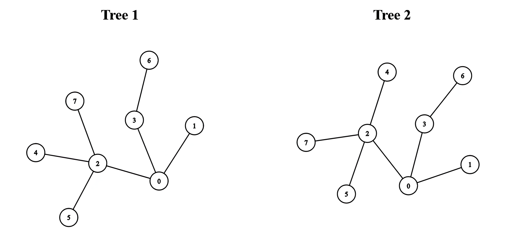

There exist two **undirected** trees with `n` and `m` nodes, numbered from `0` to `n - 1` and from `0` to `m - 1`, respectively. You are given two 2D integer arrays `edges1` and `edges2` of lengths `n - 1` and `m - 1`, respectively, where `edges1[i] = [a_i, b_i]` indicates that there is an edge between nodes `a_i` and `b_i` in the first tree and `edges2[i] = [u_i, v_i]` indicates that there is an edge between nodes `u_i` and `v_i` in the second tree.

You must connect one node from the first tree with another node from the second tree with an edge.

Return the **minimum** possible **diameter** of the resulting tree.

The **diameter** of a tree is the length of the _longest_ path between any two nodes in the tree.

**Example 1:**

**Input:** edges1 = [[0,1],[0,2],[0,3]], edges2 = [[0,1]]

**Output:** 3

**Explanation:**

We can obtain a tree of diameter 3 by connecting node 0 from the first tree with any node from the second tree.

**Example 2:**

**Input:** edges1 = [[0,1],[0,2],[0,3],[2,4],[2,5],[3,6],[2,7]], edges2 = [[0,1],[0,2],[0,3],[2,4],[2,5],[3,6],[2,7]]

**Output:** 5

**Explanation:**

We can obtain a tree of diameter 5 by connecting node 0 from the first tree with node 0 from the second tree.

**Constraints:**

-   `1 <= n, m <= 10^5`
-   `edges1.length == n - 1`
-   `edges2.length == m - 1`
-   `edges1[i].length == edges2[i].length == 2`
-   `edges1[i] = [a_i, b_i]`
-   `0 <= a_i, b_i < n`
-   `edges2[i] = [u_i, v_i]`
-   `0 <= u_i, v_i < m`
-   The input is generated such that `edges1` and `edges2` represent valid trees.
