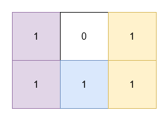
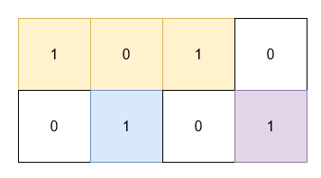

You are given a 2D **binary** array `grid`. You need to find 3 **non-overlapping** rectangles having **non-zero** areas with horizontal and vertical sides such that all the 1's in `grid` lie inside these rectangles.

Return the **minimum** possible sum of the area of these rectangles.

**Note** that the rectangles are allowed to touch.


**Example 1:**



``` Java
Input: grid = [[1,0,1],[1,1,1]]

Output: 5

Explanation:

 * The 1's at (0, 0) and (1, 0) are covered by a rectangle of area 2.
 * The 1's at (0, 2) and (1, 2) are covered by a rectangle of area 2.
 * The 1 at (1, 1) is covered by a rectangle of area 1.
```


**Example 2:**



``` Java
Input: grid = [[1,0,1,0],[0,1,0,1]]

Output: 5

Explanation:

 * The 1's at (0, 0) and (0, 2) are covered by a rectangle of area 3.
 * The 1 at (1, 1) is covered by a rectangle of area 1.
 * The 1 at (1, 3) is covered by a rectangle of area 1.
```


**Constraints:**

 * `1 <= grid.length, grid[i].length <= 30`
 * `grid[i][j]` is either 0 or 1.
 * The input is generated such that there are at least three 1's in `grid`.
