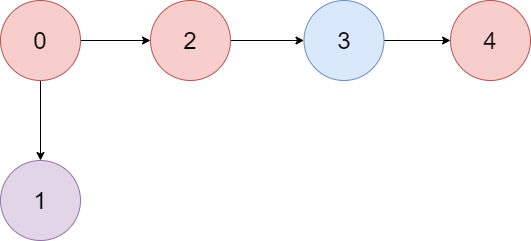
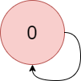

There is a **directed graph** of `n` colored nodes and `m` edges. The nodes are numbered from `0` to `n - 1`.

You are given a string `colors` where `colors[i]` is a lowercase English letter representing the **color** of the `i^th` node in this graph (**0-indexed**). You are also given a 2D array `edges` where `edges[j] = [a_j, b_j]` indicates that there is a **directed edge** from node `a_j` to node `b_j`.

A valid **path** in the graph is a sequence of nodes `x_1 -> x_2 -> x_3 -> ... -> x_k` such that there is a directed edge from `x_i` to `x_i+1` for every `1 <= i < k`. The **color value** of the path is the number of nodes that are colored the **most frequently** occurring color along that path.

Return _the **largest color value** of any valid path in the given graph, or_ `-1` _if the graph contains a cycle_.


**Example 1:**



``` Java
Input: colors = "abaca", edges = [[0,1],[0,2],[2,3],[3,4]]
Output: 3
Explanation: The path 0 -> 2 ->; 3 -> 4 contains 3 nodes that are colored "a" (red in the above image).
```


**Example 2:**



``` Java
Input: colors = "a", edges = [[0,0]]
Output: -1
Explanation: There is a cycle from 0 to 0.
```


**Constraints:**

-   `n == colors.length`
-   `m == edges.length`
-   `1 <= n <= 10^5`
-   `0 <= m <= 10^5`
-   `colors` consists of lowercase English letters.
-   `0 <= a_j, b_j < n`
