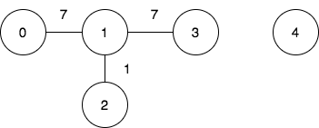
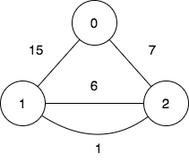

There is an undirected weighted graph with `n` vertices labeled from `0` to `n - 1`.

You are given the integer `n` and an array `edges`, where `edges[i] = [u_i, v_i, w_i]` indicates that there is an edge between vertices `u_i` and `v_i` with a weight of `w_i`.

A walk on a graph is a sequence of vertices and edges. The walk starts and ends with a vertex, and each edge connects the vertex that comes before it and the vertex that comes after it. It's important to note that a walk may visit the same edge or vertex more than once.

The **cost** of a walk starting at node `u` and ending at node `v` is defined as the bitwise `AND` of the weights of the edges traversed during the walk. In other words, if the sequence of edge weights encountered during the walk is `w_0, w_1, w_2, ..., w_k`, then the cost is calculated as `w_0 & w_1 & w_2 & ... & w_k`, where `&` denotes the bitwise `AND` operator.

You are also given a 2D array `query`, where `query[i] = [s_i, t_i]`. For each query, you need to find the minimum cost of the walk starting at vertex `s_i` and ending at vertex `t_i`. If there exists no such walk, the answer is `-1`.

Return _the array_ `answer`_, where_ `answer[i]` _denotes the **minimum** cost of a walk for query_ `i`.

**Example 1:**

**Input:** n = 5, edges = \[\[0,1,7\],\[1,3,7\],\[1,2,1\]\], query = \[\[0,3\],\[3,4\]\]

**Output:** \[1,-1\]

**Explanation:**

To achieve the cost of 1 in the first query, we need to move on the following edges: `0->1` (weight 7), `1->2` (weight 1), `2->1` (weight 1), `1->3` (weight 7).

In the second query, there is no walk between nodes 3 and 4, so the answer is -1.

**Example 2:**

**Input:** n = 3, edges = \[\[0,2,7\],\[0,1,15\],\[1,2,6\],\[1,2,1\]\], query = \[\[1,2\]\]

**Output:** \[0\]

**Explanation:**

To achieve the cost of 0 in the first query, we need to move on the following edges: `1->2` (weight 1), `2->1` (weight 6), `1->2` (weight 1).

**Constraints:**

-   `2 <= n <= 10^5`
-   `0 <= edges.length <= 10^5`
-   `edges[i].length == 3`
-   `0 <= u_i, v_i <= n - 1`
-   `u_i != v_i`
-   `0 <= w_i <= 10^5`
-   `1 <= query.length <= 10^5`
-   `query[i].length == 2`
-   `0 <= s_i, t_i <= n - 1`
-   `s_i != t_i`
