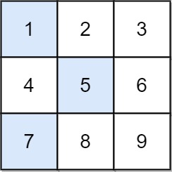

Given an `n x n` integer matrix `grid`, return _the minimum sum of a **falling path with non-zero shifts**_.

A **falling path with non-zero shifts** is a choice of exactly one element from each row of `grid` such that no two elements chosen in adjacent rows are in the same column.


**Example 1:**



``` Java 
Input: grid = [[1,2,3],[4,5,6],[7,8,9]]
Output: 13
Explanation:
The possible falling paths are:
[1,5,9], [1,5,7], [1,6,7], [1,6,8],
[2,4,8], [2,4,9], [2,6,7], [2,6,8],
[3,4,8], [3,4,9], [3,5,7], [3,5,9]
The falling path with the smallest sum is [1,5,7], so the answer is 13.
```


**Example 2:**

``` Java
Input: grid = [[7]]
Output: 7
```


**Constraints:**

* `n == grid.length == grid[i].length`
* `1 <= n <= 200`
* `-99 <= grid[i][j] <= 99`
