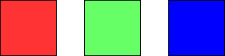
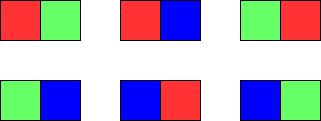

You are given two integers `m` and `n`. Consider an `m x n` grid where each cell is initially white. You can paint each cell **red**, **green**, or **blue**. All cells **must** be painted.

Return _the number of ways to color the grid with **no two adjacent cells having the same color**_. Since the answer can be very large, return it **modulo** `10^9 + 7`.


**Example 1:**



``` Java
Input: m = 1, n = 1
Output: 3
Explanation: The three possible colorings are shown in the image above.
```


**Example 2:**



``` Java
Input: m = 1, n = 2
Output: 6
Explanation: The six possible colorings are shown in the image above.
```


**Example 3:**

``` Java
Input: m = 5, n = 5
Output: 580986
```


**Constraints:**

-   `1 <= m <= 5`
-   `1 <= n <= 1000`
