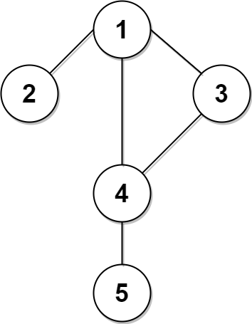

A city is represented as a **bi-directional connected** graph with `n` vertices where each vertex is labeled from `1` to `n` (**inclusive**). The edges in the graph are represented as a 2D integer array `edges`, where each `edges[i] = [u_i, v_i]` denotes a bi-directional edge between vertex `u_i` and vertex `v_i`. Every vertex pair is connected by **at most one** edge, and no vertex has an edge to itself. The time taken to traverse any edge is `time` minutes.

Each vertex has a traffic signal which changes its color from **green** to **red** and vice versa every `change` minutes. All signals change **at the same time**. You can enter a vertex at **any time**, but can leave a vertex **only when the signal is green**. You **cannot wait** at a vertex if the signal is **green**.

The **second minimum value** is defined as the smallest value **strictly larger** than the minimum value.

-   For example the second minimum value of `[2, 3, 4]` is `3`, and the second minimum value of `[2, 2, 4]` is `4`.

Given `n`, `edges`, `time`, and `change`, return _the **second minimum time** it will take to go from vertex_ `1` _to vertex_ `n`.


**Notes:**

-   You can go through any vertex **any** number of times, **including** `1` and `n`.
-   You can assume that when the journey **starts**, all signals have just turned **green**.


**Example 1:**



``` Java
Input: n = 5, edges = [[1,2],[1,3],[1,4],[3,4],[4,5]], time = 3, change = 5
Output: 13
Explanation:
The figure on the left shows the given graph.
The blue path in the figure on the right is the minimum time path.
The time taken is:
- Start at 1, time elapsed=0
- 1 -&gt; 4: 3 minutes, time elapsed=3
- 4 -&gt; 5: 3 minutes, time elapsed=6
Hence the minimum time needed is 6 minutes.

The red path shows the path to get the second minimum time.
- Start at 1, time elapsed=0
- 1 -&gt; 3: 3 minutes, time elapsed=3
- 3 -&gt; 4: 3 minutes, time elapsed=6
- Wait at 4 for 4 minutes, time elapsed=10
- 4 -&gt; 5: 3 minutes, time elapsed=13
Hence the second minimum time is 13 minutes.      
```


**Example 2:**


``` Java
Input: n = 2, edges = [[1,2]], time = 3, change = 2
Output: 11
Explanation:
The minimum time path is 1 -&gt; 2 with time = 3 minutes.
The second minimum time path is 1 -&gt; 2 -&gt; 1 -&gt; 2 with time = 11 minutes.
```


**Constraints:**

-   `2 <= n <= 10^4`
-   `n - 1 <= edges.length <= min(2 * 10^4, n * (n - 1) / 2)`
-   `edges[i].length == 2`
-   `1 <= u_i, v_i <= n`
-   `u_i != v_i`
-   There are no duplicate edges.
-   Each vertex can be reached directly or indirectly from every other vertex.
-   `1 <= time, change <= 10^3`
