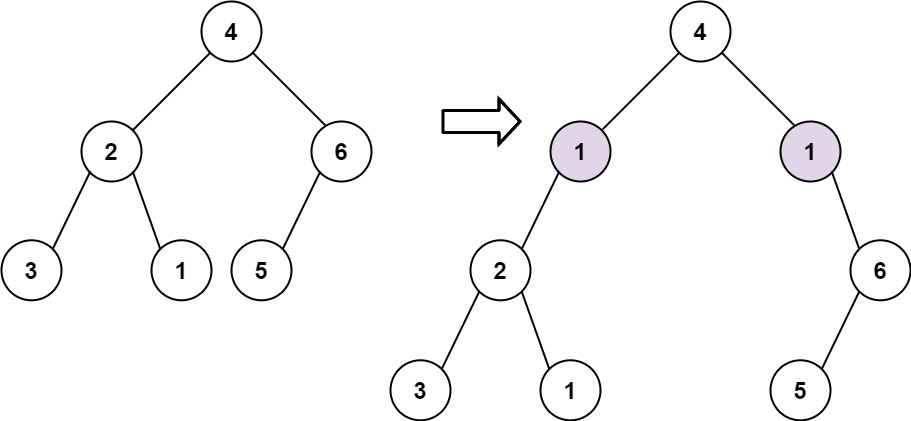
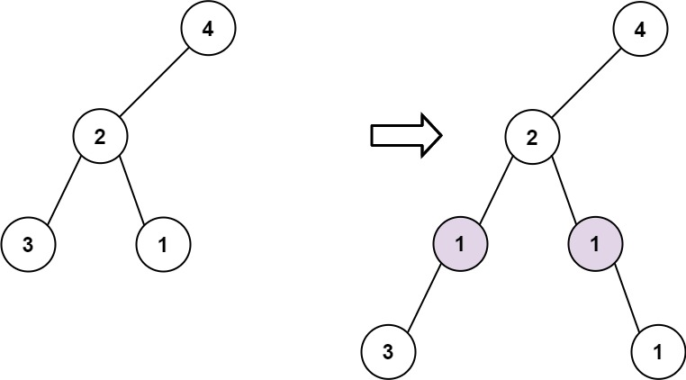

Given the `root` of a binary tree and two integers `val` and `depth`, add a row of nodes with value `val` at the given depth `depth`.

Note that the `root` node is at depth `1`.

The adding rule is:

* Given the integer `depth`, for each not null tree node `cur` at the depth `depth - 1`, create two tree nodes with value `val` as `cur`'s left subtree root and right subtree root.
* `cur`'s original left subtree should be the left subtree of the new left subtree root.
* `cur`'s original right subtree should be the right subtree of the new right subtree root.
* If `depth == 1` that means there is no depth `depth - 1` at all, then create a tree node with value `val` as the new root of the whole original tree, and the original tree is the new root's left subtree.


**Example 1:**



``` Java
Input: root = [4,2,6,3,1,5], val = 1, depth = 2
Output: [4,1,1,2,null,null,6,3,1,5]
```


**Example 2:**



``` Java
Input: root = [4,2,null,3,1], val = 1, depth = 3
Output: [4,2,null,1,1,3,null,null,1]
```


**Constraints:**

* The number of nodes in the tree is in the range `[1, 10^4]`.
* The depth of the tree is in the range `[1, 10^4]`.
* `-100 <= Node.val <= 100`
* `-10^5 <= val <= 10^5`
* `1 <= depth <= the depth of tree + 1`
