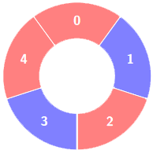
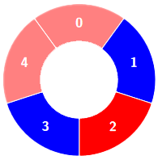
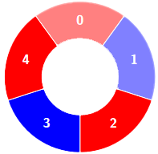
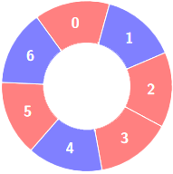
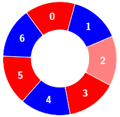
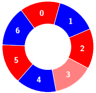
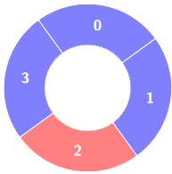

There is a circle of red and blue tiles. You are given an array of integers `colors` and an integer `k`. The color of tile `i` is represented by `colors[i]`:

-   `colors[i] == 0` means that tile `i` is **red**.
-   `colors[i] == 1` means that tile `i` is **blue**.

An **alternating** group is every `k` contiguous tiles in the circle with **alternating** colors (each tile in the group except the first and last one has a different color from its **left** and **right** tiles).

Return the number of **alternating** groups.

**Note** that since `colors` represents a **circle**, the **first** and the **last** tiles are considered to be next to each other.

**Example 1:**

**Input:** colors = \[0,1,0,1,0\], k = 3

**Output:** 3

**Explanation:**

Alternating groups:

**Example 2:**

**Input:** colors = \[0,1,0,0,1,0,1\], k = 6

**Output:** 2

**Explanation:**

Alternating groups:

**Example 3:**

**Input:** colors = \[1,1,0,1\], k = 4

**Output:** 0

**Explanation:**

**Constraints:**

-   `3 <= colors.length <= 10^5`
-   `0 <= colors[i] <= 1`
-   `3 <= k <= colors.length`
