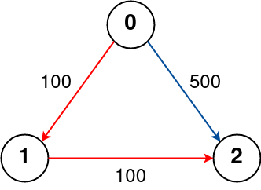

There are `n` cities connected by some number of flights. You are given an array `flights` where `flights[i] = [from_i, to_i, price_i]` indicates that there is a flight from city `from_i` to city `to_i` with cost `price_i`.

You are also given three integers `src`, `dst`, and `k`, return _**the cheapest price** from_ `src` _to_ `dst` _with at most_ `k` _stops._ If there is no such route, return `-1`.

**Example 1:**


```
Input: n = 4, flights = [[0,1,100],[1,2,100],[2,0,100],[1,3,600],[2,3,200]], src = 0, dst = 3, k = 1
Output: 700
Explanation:
The graph is shown above.
The optimal path with at most 1 stop from city 0 to 3 is marked in red and has cost 100 + 600 = 700.
Note that the path through cities [0,1,2,3] is cheaper but is invalid because it uses 2 stops.
```

**Example 2:**



```
Input: n = 3, flights = [[0,1,100],[1,2,100],[0,2,500]], src = 0, dst = 2, k = 1
Output: 200
Explanation:
The graph is shown above.
The optimal path with at most 1 stop from city 0 to 2 is marked in red and has cost 100 + 100 = 200.
```

**Example 3:**


```
Input: n = 3, flights = [[0,1,100],[1,2,100],[0,2,500]], src = 0, dst = 2, k = 0
Output: 500
Explanation:
The graph is shown above.
The optimal path with no stops from city 0 to 2 is marked in red and has cost 500.
```

**Constraints:**

-   `1 <= n <= 100`
-   `0 <= flights.length <= (n * (n - 1) / 2)`
-   `flights[i].length == 3`
-   `0 <= from_i, to_i < n`
-   `from_i != to_i`
-   `1 <= price_i <= 10^4`
-   There will not be any multiple flights between two cities.
-   `0 <= src, dst, k < n`
-   `src != dst`
