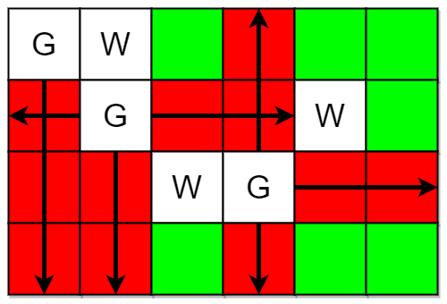
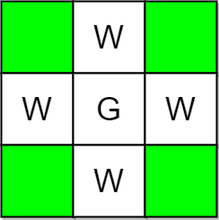

You are given two integers `m` and `n` representing a **0-indexed** `m x n` grid. You are also given two 2D integer arrays `guards` and `walls` where `guards[i] = [row_i, col_i]` and `walls[j] = [row_j, col_j]` represent the positions of the `i^th` guard and `j^th` wall respectively.

A guard can see **every** cell in the four cardinal directions (north, east, south, or west) starting from their position unless **obstructed** by a wall or another guard. A cell is **guarded** if there is **at least** one guard that can see it.

Return _the number of unoccupied cells that are **not** **guarded**._


**Example 1:**



``` Java
Input: m = 4, n = 6, guards = [[0,0],[1,1],[2,3]], walls = [[0,1],[2,2],[1,4]]
Output: 7
Explanation: The guarded and unguarded cells are shown in red and green respectively in the above diagram.
There are a total of 7 unguarded cells, so we return 7.
```


**Example 2:**



``` Java
Input: m = 3, n = 3, guards = [[1,1]], walls = [[0,1],[1,0],[2,1],[1,2]]
Output: 4
Explanation: The unguarded cells are shown in green in the above diagram.
There are a total of 4 unguarded cells, so we return 4.
```


**Constraints:**

-   `1 <= m, n <= 10^5`
-   `2 <= m * n <= 10^5`
-   `1 <= guards.length, walls.length <= 5 * 10^4`
-   `2 <= guards.length + walls.length <= m * n`
-   `guards[i].length == walls[j].length == 2`
-   `0 <= row_i, row_j < m`
-   `0 <= col_i, col_j < n`
-   All the positions in `guards` and `walls` are **unique**.
