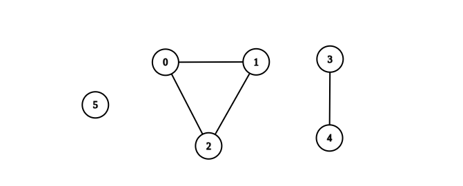
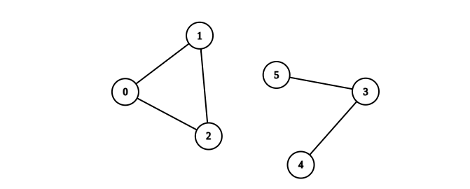

You are given an integer `n`. There is an **undirected** graph with `n` vertices, numbered from `0` to `n - 1`. You are given a 2D integer array `edges` where `edges[i] = [a_i, b_i]` denotes that there exists an **undirected** edge connecting vertices `a_i` and `b_i`.

Return _the number of **complete connected components** of the graph_.

A **connected component** is a subgraph of a graph in which there exists a path between any two vertices, and no vertex of the subgraph shares an edge with a vertex outside of the subgraph.

A connected component is said to be **complete** if there exists an edge between every pair of its vertices.


**Example 1:**



``` Java
Input: n = 6, edges = [[0,1],[0,2],[1,2],[3,4]]
Output: 3
Explanation: From the picture above, one can see that all of the components of this graph are complete.
```


**Example 2:**



``` Java
Input: n = 6, edges = [[0,1],[0,2],[1,2],[3,4],[3,5]]
Output: 1
Explanation: The component containing vertices 0, 1, and 2 is complete since there is an edge between every pair of two vertices. On the other hand, the component containing vertices 3, 4, and 5 is not complete since there is no edge between vertices 4 and 5. Thus, the number of complete components in this graph is 1.
```


**Constraints:**

-   `1 <= n <= 50`
-   `0 <= edges.length <= n * (n - 1) / 2`
-   `edges[i].length == 2`
-   `0 <= a_i, b_i <= n - 1`
-   `a_i != b_i`
-   There are no repeated edges.
