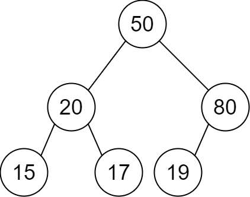
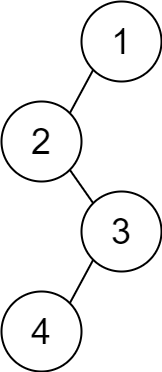

You are given a 2D integer array `descriptions` where `descriptions[i] = [parent_i, child_i, isLeft_i]` indicates that `parent_i` is the **parent** of `child_i` in a **binary** tree of **unique** values. Furthermore,

-   If `isLeft_i == 1`, then `child_i` is the left child of `parent_i`.
-   If `isLeft_i == 0`, then `child_i` is the right child of `parent_i`.

Construct the binary tree described by `descriptions` and return _its **root**_.

The test cases will be generated such that the binary tree is **valid**.


**Example 1:**



``` Java
Input: descriptions = [[20,15,1],[20,17,0],[50,20,1],[50,80,0],[80,19,1]]
Output: [50,20,80,15,17,19]
Explanation: The root node is the node with value 50 since it has no parent.
The resulting binary tree is shown in the diagram.
```


**Example 2:**



``` Java
Input: descriptions = [[1,2,1],[2,3,0],[3,4,1]]
Output: [1,2,null,null,3,4]
Explanation: The root node is the node with value 1 since it has no parent.
The resulting binary tree is shown in the diagram.
```


**Constraints:**

-   `1 <= descriptions.length <= 10^4`
-   `descriptions[i].length == 3`
-   `1 <= parent_i, child_i <= 10^5`
-   `0 <= isLeft_i <= 1`
-   The binary tree described by `descriptions` is valid.
