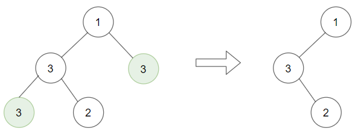

Given a binary tree `root` and an integer `target`, delete all the **leaf nodes** with value `target`.

Note that once you delete a leaf node with value `target`, if its parent node becomes a leaf node and has the value `target`, it should also be deleted (you need to continue doing that until you cannot).


**Example 1:**


``` Java
Input: root = [1,2,3,2,null,2,4], target = 2
Output: [1,null,3,null,4]
Explanation: Leaf nodes in green with value (target = 2) are removed (Picture in left).
After removing, new nodes become leaf nodes with value (target = 2) (Picture in center).
```


**Example 2:**



``` Java
Input: root = [1,3,3,3,2], target = 3
Output: [1,3,null,null,2]
```


**Example 3:**


``` Java
Input: root = [1,2,null,2,null,2], target = 2
Output: [1]
Explanation: Leaf nodes in green with value (target = 2) are removed at each step.
```


**Constraints:**

* The number of nodes in the tree is in the range `[1, 3000]`.
* `1 <= Node.val, target <= 1000`
