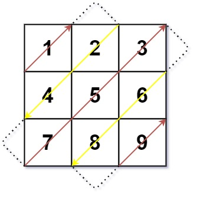

Given an `m x n` matrix `mat`, return _an array of all the elements of the array in a diagonal order_.


**Example 1:**



``` Java
Input: mat = [[1,2,3],[4,5,6],[7,8,9]]
Output: [1,2,4,7,5,3,6,8,9]
```


**Example 2:**

``` Java
Input: mat = [[1,2],[3,4]]
Output: [1,2,3,4]
```


**Constraints:**

-   `m == mat.length`
-   `n == mat[i].length`
-   `1 <= m, n <= 10^4`
-   `1 <= m * n <= 10^4`
-   `-10^5 <= mat[i][j] <= 10^5`
