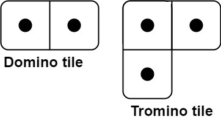
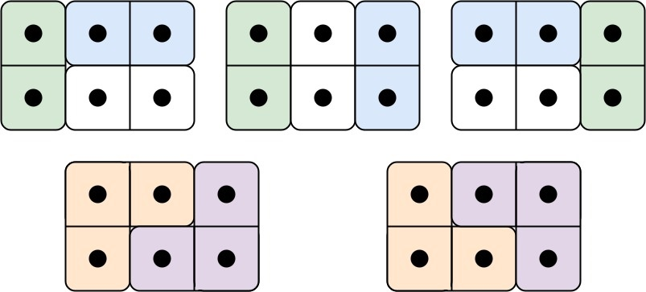

You have two types of tiles: a `2 x 1` domino shape and a tromino shape. You may rotate these shapes.



Given an integer n, return _the number of ways to tile an_ `2 x n` _board_. Since the answer may be very large, return it **modulo** `10^9 + 7`.

In a tiling, every square must be covered by a tile. Two tilings are different if and only if there are two 4-directionally adjacent cells on the board such that exactly one of the tilings has both squares occupied by a tile.


**Example 1:**



``` Java
Input: n = 3
Output: 5
Explanation: The five different ways are show above.
```


**Example 2:**

``` Java
Input: n = 1
Output: 1
```


**Constraints:**

-   `1 <= n <= 1000`
