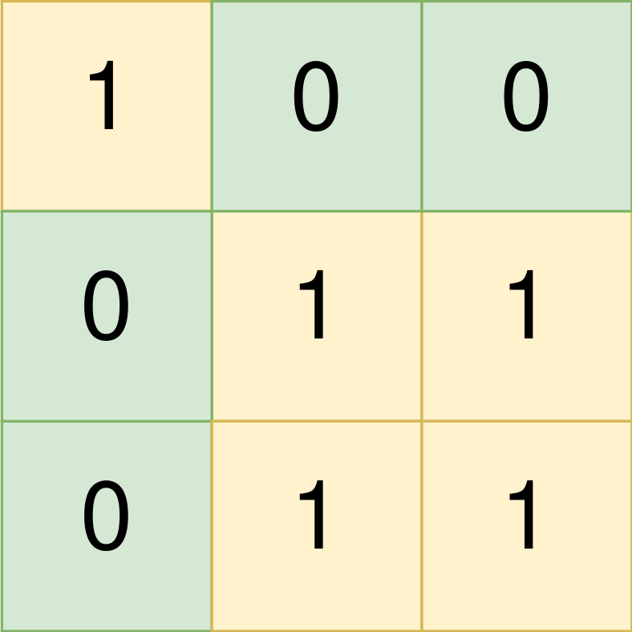
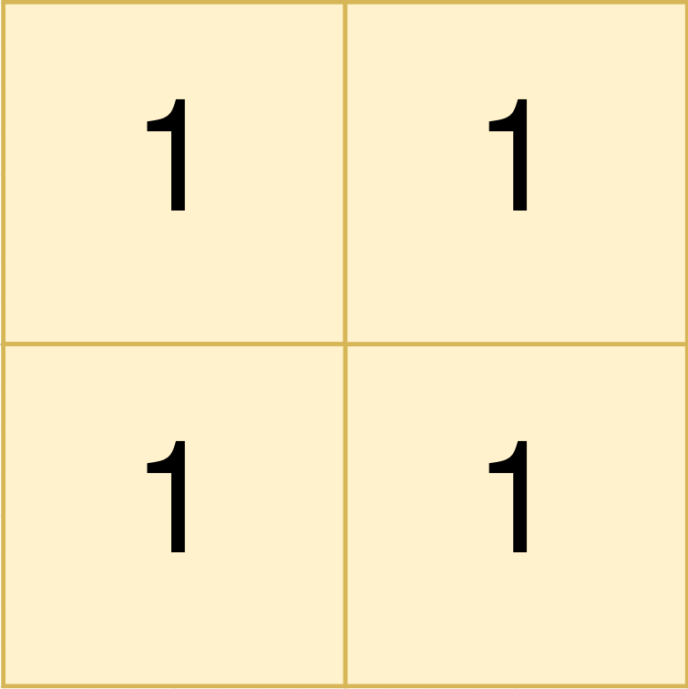
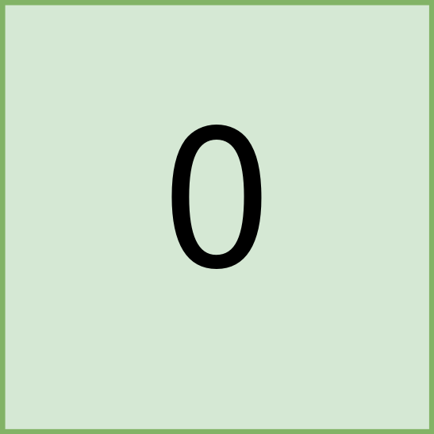

You are given a **0-indexed** `m x n` binary matrix `land` where a `0` represents a hectare of forested land and a `1` represents a hectare of farmland.

To keep the land organized, there are designated rectangular areas of hectares that consist **entirely** of farmland. These rectangular areas are called **groups**. No two groups are adjacent, meaning farmland in one group is **not** four-directionally adjacent to another farmland in a different group.

`land` can be represented by a coordinate system where the top left corner of `land` is `(0, 0)` and the bottom right corner of `land` is `(m-1, n-1)`. Find the coordinates of the top left and bottom right corner of each **group** of farmland. A **group** of farmland with a top left corner at `(r_1, c_1)` and a bottom right corner at `(r_2, c_2)` is represented by the 4-length array `[r_1, c_1, r_2, c_2].`

Return _a 2D array containing the 4-length arrays described above for each **group** of farmland in_ `land`_. If there are no groups of farmland, return an empty array. You may return the answer in **any order**_.


**Example 1:**



``` Java
Input: land = [[1,0,0],[0,1,1],[0,1,1]]
Output: [[0,0,0,0],[1,1,2,2]]
Explanation:
The first group has a top left corner at land[0][0] and a bottom right corner at land[0][0].
The second group has a top left corner at land[1][1] and a bottom right corner at land[2][2].
```


**Example 2:**



``` Java
Input: land = [[1,1],[1,1]]
Output: [[0,0,1,1]]
Explanation:
The first group has a top left corner at land[0][0] and a bottom right corner at land[1][1].
```


**Example 3:**



``` Java
Input: land = [[0]]
Output: []
Explanation:
There are no groups of farmland.
```


**Constraints:**

-   `m == land.length`
-   `n == land[i].length`
-   `1 <= m, n <= 300`
-   `land` consists of only `0`'s and `1`'s.
-   Groups of farmland are **rectangular** in shape.
