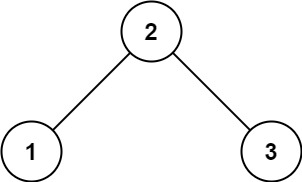
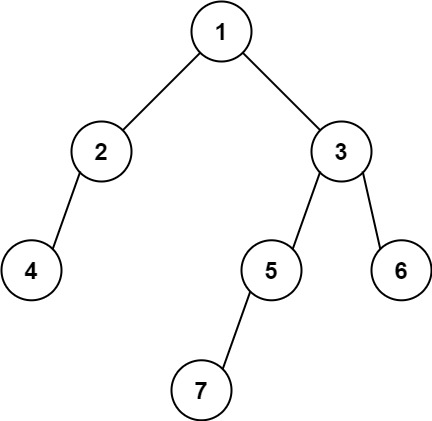

Given the `root` of a binary tree, return the leftmost value in the last row of the tree.

**Example 1:**



```
Input: root = [2,1,3]
Output: 1
```

**Example 2:**



```
Input: root = [1,2,3,4,null,5,6,null,null,7]
Output: 7
```

**Constraints:**

-   The number of nodes in the tree is in the range `[1, 10^4]`.
-   `-2^31 <= Node.val <= 2^31 - 1`
