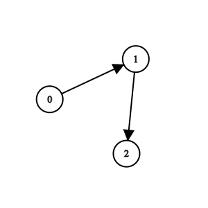
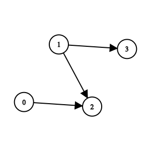

There are `n` teams numbered from `0` to `n - 1` in a tournament; each team is also a node in a **DAG**.

You are given the integer `n` and a **0-indexed** 2D integer array `edges` of length `m` representing the **DAG**, where `edges[i] = [u_i, v_i]` indicates that there is a directed edge from team `u_i` to team `v_i` in the graph.

A directed edge from `a` to `b` in the graph means that team `a` is **stronger** than team `b` and team `b` is **weaker** than team `a`.

Team `a` will be the **champion** of the tournament if there is no team `b` that is **stronger** than team `a`.

Return _the team that will be the **champion** of the tournament if there is a **unique** champion, otherwise, return_ `-1`_._

**Notes**

-   A **cycle** is a series of nodes `a_1, a_2, ..., a_n, a_n+1` such that node `a_1` is the same node as node `a_n+1`, the nodes `a_1, a_2, ..., a_n` are distinct, and there is a directed edge from the node `a_i` to node `a_i+1` for every `i` in the range `[1, n]`.
-   A **DAG** is a directed graph that does not have any **cycle**.


**Example 1:**



``` Java
Input: n = 3, edges = [[0,1],[1,2]]
Output: 0
Explanation:>Team 1 is weaker than team 0. Team 2 is weaker than team 1. So the champion is team 0.
```


**Example 2:**



``` Java
Input: n = 4, edges = [[0,2],[1,3],[1,2]]
Output: -1
Explanation: Team 2 is weaker than team 0 and team 1. Team 3 is weaker than team 1. But team 1 and team 0 are not weaker than any other teams. So the answer is -1.
```


**Constraints:**

-   `1 <= n <= 100`
-   `m == edges.length`
-   `0 <= m <= n * (n - 1) / 2`
-   `edges[i].length == 2`
-   `0 <= edge[i][j] <= n - 1`
-   `edges[i][0] != edges[i][1]`
-   The input is generated such that if team `a` is stronger than team `b`, team `b` is not stronger than team `a`.
-   The input is generated such that if team `a` is stronger than team `b` and team `b` is stronger than team `c`, then team `a` is stronger than team `c`.
