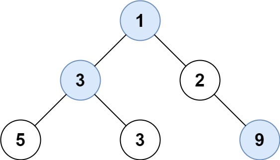

Given the `root` of a binary tree, return _an array of the largest value in each row_ of the tree **(0-indexed)**.


**Example 1:**



``` Java
Input: root = [1,3,2,5,3,null,9]
Output: [1,3,9]
```


**Example 2:**

``` Java
Input: root = [1,2,3]
Output: [1,3]
```


**Constraints:**

-   The number of nodes in the tree will be in the range `[0, 10^4]`.
-   `-2^31 <= Node.val <= 2^31 - 1`
