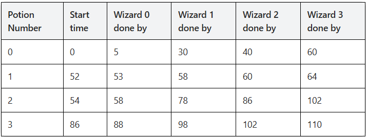

You are given two integer arrays, `skill` and `mana`, of length `n` and `m`, respectively.

In a laboratory, `n` wizards must brew `m` potions *in order*. Each potion has a mana capacity `mana[j]` and **must** pass through **all** the wizards sequentially to be brewed properly. The time taken by the `i^th` wizard on the `j^th` potion is `time_ij = skill[i] * mana[j]`.

Since the brewing process is delicate, a potion **must** be passed to the next wizard immediately after the current wizard completes their work. This means the timing must be synchronized so that each wizard begins working on a potion **exactly** when it arrives.

Return the **minimum** amount of time required for the potions to be brewed properly.


**Example 1:**

``` Java
Input: skill = [1,5,2,4], mana = [5,1,4,2]

Output: 110
```

**Explanation:**



``` Java
As an example for why wizard 0 cannot start working on the 1st potion before time t = 52, consider the case where the wizards started preparing the 1st potion at time t = 50. At time t = 58, wizard 2 is done with the 1st potion, but wizard 3 will still be working on the 0th potion till time t = 60.
```


**Example 2:**

``` Java
Input: skill = [1,1,1], mana = [1,1,1]

Output: 5

Explanation:

 1. Preparation of the 0th potion begins at time t = 0, and is completed by time t = 3.
 2. Preparation of the 1st potion begins at time t = 1, and is completed by time t = 4.
 3. Preparation of the 2nd potion begins at time t = 2, and is completed by time t = 5.
```


**Example 3:**

``` Java
Input: skill = [1,2,3,4], mana = [1,2]

Output: 21
```


**Constraints:**

 * `n == skill.length`
 * `m == mana.length`
 * `1 <= n, m <= 5000`
 * `1 <= mana[i], skill[i] <= 5000`
