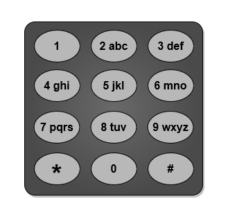
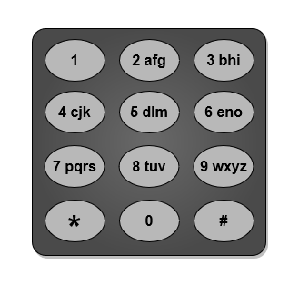
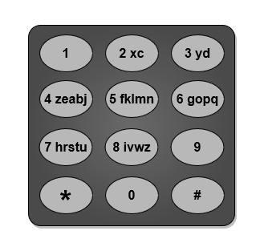
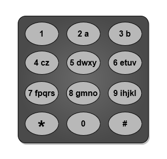

You are given a string `word` containing lowercase English letters.

Telephone keypads have keys mapped with **distinct** collections of lowercase English letters, which can be used to form words by pushing them. For example, the key `2` is mapped with `["a","b","c"]`, we need to push the key one time to type `"a"`, two times to type `"b"`, and three times to type `"c"` _._

It is allowed to remap the keys numbered `2` to `9` to **distinct** collections of letters. The keys can be remapped to **any** amount of letters, but each letter **must** be mapped to **exactly** one key. You need to find the **minimum** number of times the keys will be pushed to type the string `word`.

Return _the **minimum** number of pushes needed to type_ `word` _after remapping the keys_.

An example mapping of letters to keys on a telephone keypad is given below. Note that `1`, `*`, `#`, and `0` do **not** map to any letters.





**Example 1:**



``` Java
Input: word = "abcde"
Output: 5
Explanation: The remapped keypad given in the image provides the minimum cost.
"a" -&gt; one push on key 2
"b" -&gt; one push on key 3
"c" -&gt; one push on key 4
"d" -&gt; one push on key 5
"e" -&gt; one push on key 6
Total cost is 1 + 1 + 1 + 1 + 1 = 5.
It can be shown that no other mapping can provide a lower cost.
```


**Example 2:**



``` Java
Input: word = "xyzxyzxyzxyz"
Output: 12
Explanation: The remapped keypad given in the image provides the minimum cost.
"x" -&gt; one push on key 2
"y" -&gt; one push on key 3
"z" -&gt; one push on key 4
Total cost is 1 * 4 + 1 * 4 + 1 * 4 = 12
It can be shown that no other mapping can provide a lower cost.
Note that the key 9 is not mapped to any letter: it is not necessary to map letters to every key, but to map all the letters.
```


**Example 3:**



``` Java
Input: word = "aabbccddeeffgghhiiiiii"
Output: 24
Explanation: The remapped keypad given in the image provides the minimum cost.
"a" -&gt; one push on key 2
"b" -&gt; one push on key 3
"c" -&gt; one push on key 4
"d" -&gt; one push on key 5
"e" -&gt; one push on key 6
"f" -&gt; one push on key 7
"g" -&gt; one push on key 8
"h" -&gt; two pushes on key 9
"i" -&gt; one push on key 9
Total cost is 1 * 2 + 1 * 2 + 1 * 2 + 1 * 2 + 1 * 2 + 1 * 2 + 1 * 2 + 2 * 2 + 6 * 1 = 24.
It can be shown that no other mapping can provide a lower cost.
```


**Constraints:**

-   `1 <= word.length <= 10^5`
-   `word` consists of lowercase English letters.
