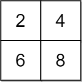
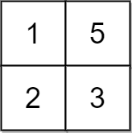
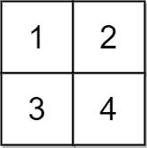

You are given a 2D integer `grid` of size `m x n` and an integer `x`. In one operation, you can **add** `x` to or **subtract** `x` from any element in the `grid`.

A **uni-value grid** is a grid where all the elements of it are equal.

Return _the **minimum** number of operations to make the grid **uni-value**_. If it is not possible, return `-1`.


**Example 1:**



``` Java
Input: grid = [[2,4],[6,8]], x = 2
Output: 4
Explanation: We can make every element equal to 4 by doing the following: 
- Add x to 2 once.
- Subtract x from 6 once.
- Subtract x from 8 twice.
A total of 4 operations were used.
```


**Example 2:**



``` Java
Input: grid = [[1,5],[2,3]], x = 1
Output: 5
Explanation: We can make every element equal to 3.
```


**Example 3:**



``` Java
Input: grid = [[1,2],[3,4]], x = 2
Output: -1
Explanation: It is impossible to make every element equal.
```


**Constraints:**

-   `m == grid.length`
-   `n == grid[i].length`
-   `1 <= m, n <= 10^5`
-   `1 <= m * n <= 10^5`
-   `1 <= x, grid[i][j] <= 10^4`
