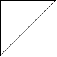
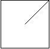
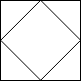

An `n x n` grid is composed of `1 x 1` squares where each `1 x 1` square consists of a `'/'`, `'\'`, or blank space `' '`. These characters divide the square into contiguous regions.

Given the grid `grid` represented as a string array, return _the number of regions_.

Note that backslash characters are escaped, so a `'\'` is represented as `'\\'`.


**Example 1:**



``` Java
Input: grid = [" /","/ "]
Output: 2
```


**Example 2:**



``` Java
Input: grid = [" /","  "]
Output: 1
```


**Example 3:**



``` Java
Input: grid = ["/\\","\\/"]
Output: 5
Explanation: Recall that because \ characters are escaped, "\\/" refers to \/, and "/\\" refers to /\.
```


**Constraints:**

-   `n == grid.length == grid[i].length`
-   `1 <= n <= 30`
-   `grid[i][j]` is either `'/'`, `'\'`, or `' '`.
