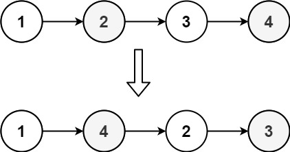
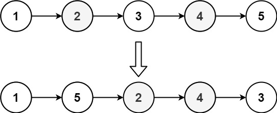

You are given the head of a singly linked-list. The list can be represented as:

``` Java
L_0 → L_1 → … → L_(n - 1) → L_n
```

_Reorder the list to be on the following form:_

``` Java
L_0 → L_n → L_1 → L_(n - 1) → L_2 → L_n - 2 → …
```

You may not modify the values in the list's nodes. Only nodes themselves may be changed.


**Example 1:**



``` Java
Input: head = [1,2,3,4]
Output: [1,4,2,3]
```

**Example 2:**



``` Java
Input: head = [1,2,3,4,5]
Output: [1,5,2,4,3]
```

**Constraints:**

-   The number of nodes in the list is in the range `[1, 5 * 10^4]`.
-   `1 <= Node.val <= 1000`

