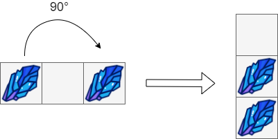
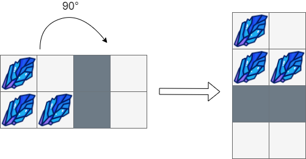
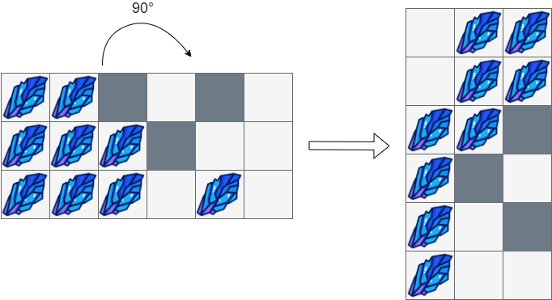

You are given an `m x n` matrix of characters `box` representing a side-view of a box. Each cell of the box is one of the following:

-   A stone `'#'`
-   A stationary obstacle `'*'`
-   Empty `'.'`

The box is rotated **90 degrees clockwise**, causing some of the stones to fall due to gravity. Each stone falls down until it lands on an obstacle, another stone, or the bottom of the box. Gravity **does not** affect the obstacles' positions, and the inertia from the box's rotation **does not** affect the stones' horizontal positions.

It is **guaranteed** that each stone in `box` rests on an obstacle, another stone, or the bottom of the box.

Return _an_ `n x m` _matrix representing the box after the rotation described above_.


**Example 1:**



``` Java
Input: box = [["#",".","#"]]
Output: [["."],
        ["#"],
        ["#"]]
```


**Example 2:**



``` Java
Input: box = [["#",".","*","."],
             ["#","#","*","."]]
Output: [["#","."],
        ["#","#"],
        ["*","*"],
        [".","."]]
```


**Example 3:**



``` Java
Input: box = [["#","#","*",".","*","."],
             ["#","#","#","*",".","."],
             ["#","#","#",".","#","."]]
Output: [[".","#","#"],
        [".","#","#"],
        ["#","#","*"],
        ["#","*","."],
        ["#",".","*"],
        ["#",".","."]]
```


**Constraints:**

-   `m == box.length`
-   `n == box[i].length`
-   `1 <= m, n <= 500`
-   `box[i][j]` is either `'#'`, `'*'`, or `'.'`.
