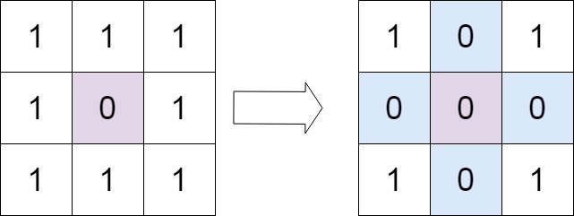

Given an `m x n` integer matrix `matrix`, if an element is `0`, set its entire row and column to `0`'s.

You must do it [in place](https://en.wikipedia.org/wiki/In-place_algorithm).


**Example 1:**



``` Java
Input: matrix = [[1,1,1],[1,0,1],[1,1,1]]
Output: [[1,0,1],[0,0,0],[1,0,1]]
```


**Example 2:**


``` Java
Input: matrix = [[0,1,2,0],[3,4,5,2],[1,3,1,5]]
Output: [[0,0,0,0],[0,4,5,0],[0,3,1,0]]
```


**Constraints:**

-   `m == matrix.length`
-   `n == matrix[0].length`
-   `1 <= m, n <= 200`
-   `-2^31 <= matrix[i][j] <= 2^31 - 1`

**Follow up:**

-   A straightforward solution using `O(mn)` space is probably a bad idea.
-   A simple improvement uses `O(m + n)` space, but still not the best solution.
-   Could you devise a constant space solution?
