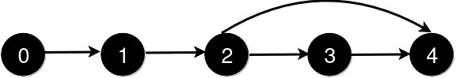
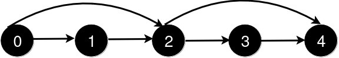
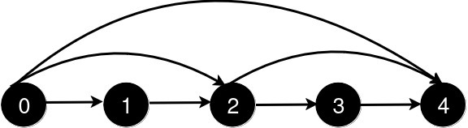
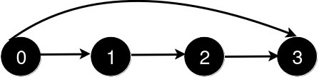
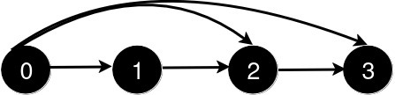

You are given an integer `n` and a 2D integer array `queries`.

There are `n` cities numbered from `0` to `n - 1`. Initially, there is a **unidirectional** road from city `i` to city `i + 1` for all `0 <= i < n - 1`.

`queries[i] = [u_i, v_i]` represents the addition of a new **unidirectional** road from city `u_i` to city `v_i`. After each query, you need to find the **length** of the **shortest path** from city `0` to city `n - 1`.

Return an array `answer` where for each `i` in the range `[0, queries.length - 1]`, `answer[i]` is the _length of the shortest path_ from city `0` to city `n - 1` after processing the **first** `i + 1` queries.

**Example 1:**

**Input:** n = 5, queries = [[2,4],[0,2],[0,4]]

**Output:** [3,2,1]

**Explanation:**

After the addition of the road from 2 to 4, the length of the shortest path from 0 to 4 is 3.

After the addition of the road from 0 to 2, the length of the shortest path from 0 to 4 is 2.

After the addition of the road from 0 to 4, the length of the shortest path from 0 to 4 is 1.

**Example 2:**

**Input:** n = 4, queries = [[0,3],[0,2]]

**Output:** [1,1]

**Explanation:**

After the addition of the road from 0 to 3, the length of the shortest path from 0 to 3 is 1.

After the addition of the road from 0 to 2, the length of the shortest path remains 1.

**Constraints:**

-   `3 <= n <= 500`
-   `1 <= queries.length <= 500`
-   `queries[i].length == 2`
-   `0 <= queries[i][0] < queries[i][1] < n`
-   `1 < queries[i][1] - queries[i][0]`
-   There are no repeated roads among the queries.
