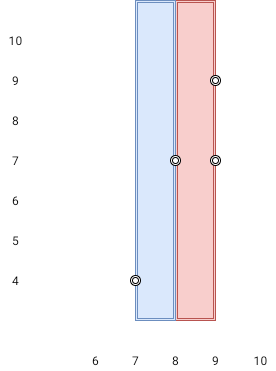

Given `n` `points` on a 2D plane where `points[i] = [x_i, y_i]`, Return _the **widest vertical area** between two points such that no points are inside the area._

A **vertical area** is an area of fixed-width extending infinitely along the y-axis (i.e., infinite height). The **widest vertical area** is the one with the maximum width.

Note that points **on the edge** of a vertical area **are not** considered included in the area.

**Example 1:**



```
Input: points = [[8,7],[9,9],[7,4],[9,7]]
Output: 1
Explanation: Both the red and the blue area are optimal.
```

**Example 2:**

```
Input: points = [[3,1],[9,0],[1,0],[1,4],[5,3],[8,8]]
Output 3
```

**Constraints:**

-   `n == points.length`
-   `2 <= n <= 10^5`
-   `points[i].length == 2`
-   `0 <= x_i, y_i <= 10^9`
