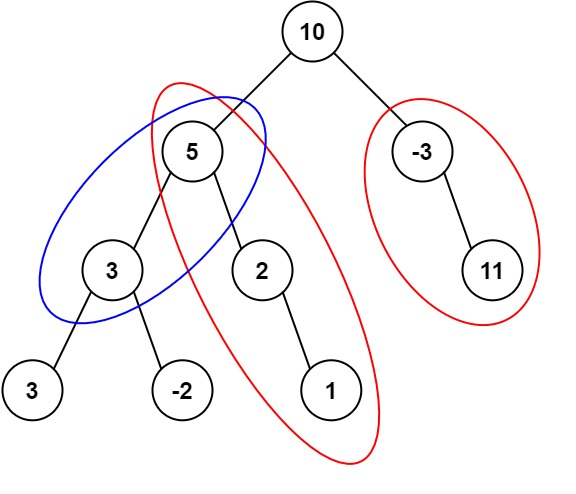

Given the `root` of a binary tree and an integer `targetSum`, return _the number of paths where the sum of the values along the path equals_ `targetSum`.

The path does not need to start or end at the root or a leaf, but it must go downwards (i.e., traveling only from parent nodes to child nodes).

**Example 1:**



```
Input: root = [10,5,-3,3,2,null,11,3,-2,null,1], targetSum = 8
Output: 3
Explanation: The paths that sum to 8 are shown.

```

**Example 2:**

```
Input: root = [5,4,8,11,null,13,4,7,2,null,null,5,1], targetSum = 22
Output: 3

```

**Constraints:**

-   The number of nodes in the tree is in the range `[0, 1000]`.
-   `-10^9 <= Node.val <= 10^9`
-   `-1000 <= targetSum <= 1000`
