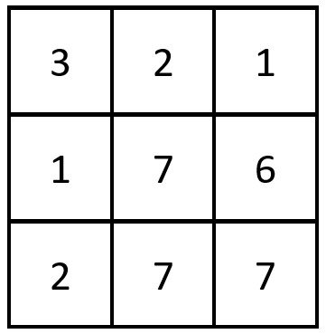
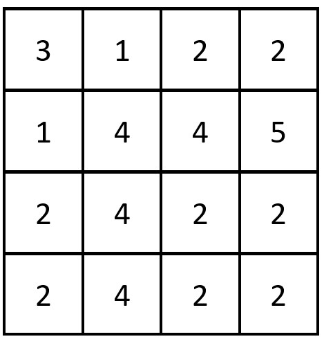

Given a **0-indexed** `n x n` integer matrix `grid`, _return the number of pairs_ `(r_i, c_j)` _such that row_ `r_i` _and column_ `c_j` _are equal_.

A row and column pair is considered equal if they contain the same elements in the same order (i.e., an equal array).

**Example 1:**



```
Input: grid = [[3,2,1],[1,7,6],[2,7,7]]
Output: 1
Explanation: There is 1 equal row and column pair:
- (Row 2, Column 1): [2,7,7]

```

**Example 2:**



```
Input: grid = [[3,1,2,2],[1,4,4,5],[2,4,2,2],[2,4,2,2]]
Output: 3
Explanation: There are 3 equal row and column pairs:
- (Row 0, Column 0): [3,1,2,2]
- (Row 2, Column 2): [2,4,2,2]
- (Row 3, Column 2): [2,4,2,2]

```

**Constraints:**

-   `n == grid.length == grid[i].length`
-   `1 <= n <= 200`
-   `1 <= grid[i][j] <= 10^5`
