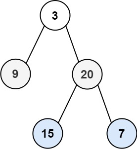

Given the `root` of a binary tree, return _the level order traversal of its nodes' values_. (i.e., from left to right, level by level).

**Example 1:**



```
Input: root = [3,9,20,null,null,15,7]
Output: [[3],[9,20],[15,7]]

```

**Example 2:**

```
Input: root = [1]
Output: [[1]]

```

**Example 3:**

```
Input: root = []
Output: []

```

**Constraints:**

-   The number of nodes in the tree is in the range `[0, 2000]`.
-   `-1000 <= Node.val <= 1000`
