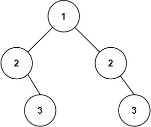

Given the `root` of a binary tree, _check whether it is a mirror of itself_ (i.e., symmetric around its center).

**Example 1:**


```
Input: root = [1,2,2,3,4,4,3]
Output: true

```

**Example 2:**



```
Input: root = [1,2,2,null,3,null,3]
Output: false

```

**Constraints:**

-   The number of nodes in the tree is in the range `[1, 1000]`.
-   `-100 <= Node.val <= 100`

**Follow up:** Could you solve it both recursively and iteratively?
