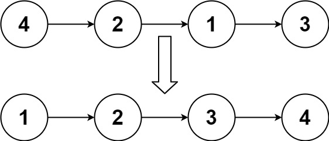

Given the `head` of a linked list, return _the list after sorting it in **ascending order**_.

**Example 1:**



```
Input: head = [4,2,1,3]
Output: [1,2,3,4]

```

**Example 2:**


```
Input: head = [-1,5,3,4,0]
Output: [-1,0,3,4,5]

```

**Example 3:**

```
Input: head = []
Output: []

```

**Constraints:**

-   The number of nodes in the list is in the range `[0, 5 * 10^4]`.
-   `-10^5 <= Node.val <= 10^5`

**Follow up:** Can you sort the linked list in `O(n logn)` time and `O(1)` memory (i.e. constant space)?
