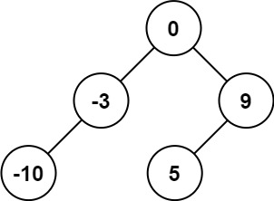
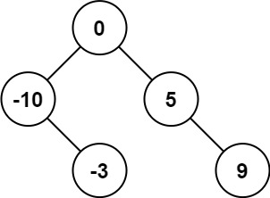
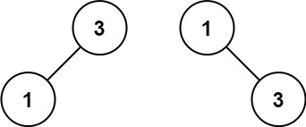

Given an integer array `nums` where the elements are sorted in **ascending order**, convert _it to a_

**_height-balanced_**

_binary search tree_.

**Example 1:**



```
Input: nums = [-10,-3,0,5,9]
Output: [0,-3,9,-10,null,5]
Explanation: [0,-10,5,null,-3,null,9] is also accepted:
```



**Example 2:**



```
Input: nums = [1,3]
Output: [3,1]
Explanation: [1,null,3] and [3,1] are both height-balanced BSTs.

```

**Constraints:**

-   `1 <= nums.length <= 10^4`
-   `-10^4 <= nums[i] <= 10^4`
-   `nums` is sorted in a **strictly increasing** order.
