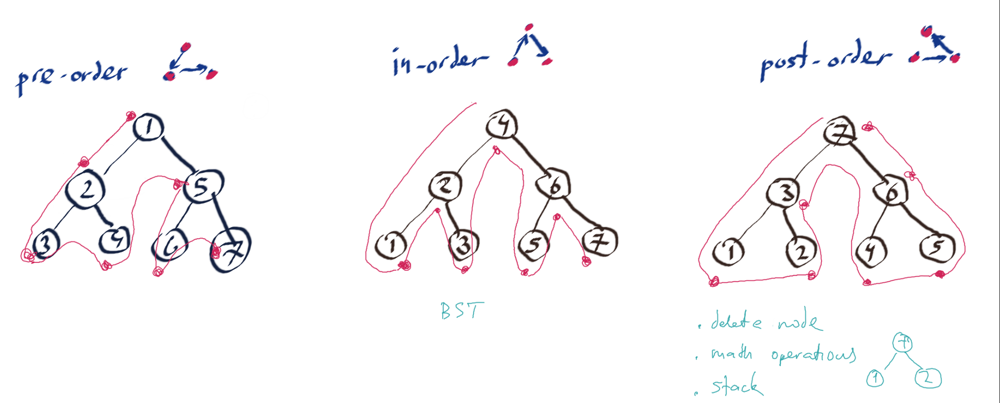

Given the root of a binary tree, return the inorder traversal of its nodes' values.

 

Example 1:

Input: root = [1,null,2,3]

Output: [1,3,2]

 

Example 2:

Input: root = []

Output: []

 

Example 3:

Input: root = [1]

Output: [1]

 

Constraints:

* The number of nodes in the tree is in the range [0, 100].
* -100 <= Node.val <= 100

Follow up: Recursive solution is trivial, could you do it iteratively?

---

 

Moris Algo:

