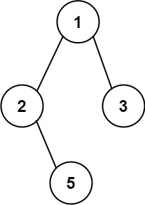

Given the `root` of a binary tree, return _all root-to-leaf paths in **any order**_.

A **leaf** is a node with no children.

**Example 1:**



``` Java
Input: root = [1,2,3,null,5]
Output: ["1-&gt;2-&gt;5","1-&gt;3"]
```

**Example 2:**

``` Java
Input: root = [1]
Output: ["1"]
```

**Constraints:**

-   The number of nodes in the tree is in the range `[1, 100]`.
-   `-100 <= Node.val <= 100`
