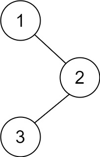

Given the `root` of a binary tree, return _the postorder traversal of its nodes' values_.

**Example 1:**



```
Input: root = [1,null,2,3]
Output: [3,2,1]
```

**Example 2:**

```
Input: root = []
Output: []
```

**Example 3:**

```
Input: root = [1]
Output: [1]
```

**Constraints:**

-   The number of the nodes in the tree is in the range `[0, 100]`.
-   `-100 <= Node.val <= 100`

**Follow up:** Recursive solution is trivial, could you do it iteratively?
