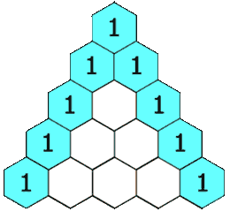

Given an integer `rowIndex`, return the `rowIndex<sup>th</sup>` (**0-indexed**) row of the **Pascal's triangle**.

In **Pascal's triangle**, each number is the sum of the two numbers directly above it as shown:




**Example 1:**

``` Java
Input: rowIndex = 3
Output: [1,3,3,1]
```


**Example 2:**

``` Java
Input: rowIndex = 0
Output: [1]
```


**Example 3:**

``` Java
Input: rowIndex = 1
Output: [1,1]
```


**Constraints:**

-   `0 <= rowIndex <= 33`

**Follow up:** Could you optimize your algorithm to use only `O(rowIndex)` extra space?
