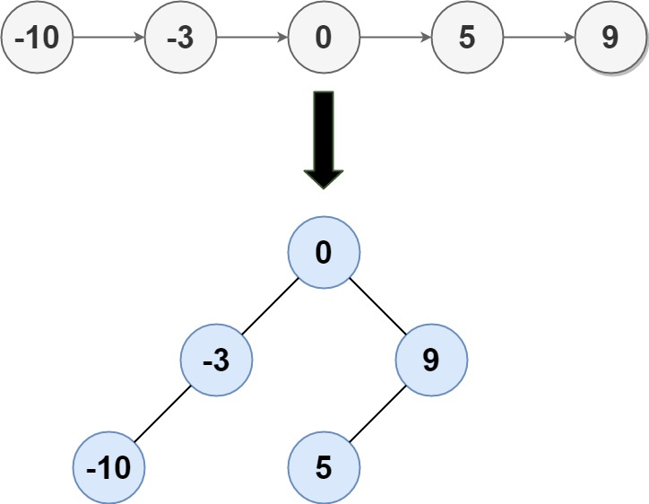

Given the `head` of a singly linked list where elements are sorted in **ascending order**, convert _it to a height-balanced binary search tree._


**Example 1:**



```
Input: head = [-10,-3,0,5,9]
Output: [0,-3,9,-10,null,5]
Explanation: One possible answer is [0,-3,9,-10,null,5], which represents the shown height balanced BST.
```


**Example 2:**

```
Input: head = []
Output: []
```


**Constraints:**

- The number of nodes in `head` is in the range `[0, 2 * 10^4]`.
- `-10^5 <= Node.val <= 10^5`
