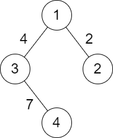

You are given a positive integer `n` representing `n` cities numbered from `1` to `n`. You are also given a **2D** array `roads` where `roads[i] = [a_i, b_i, distance_i]` indicates that there is a **bidirectional** road between cities `a_i` and `b_i` with a distance equal to `distance_i`. The cities graph is not necessarily connected.

The **score** of a path between two cities is defined as the **minimum** distance of a road in this path.

Return _the **minimum** possible score of a path between cities_ `1` _and_ `n`.

**Note**:

-   A path is a sequence of roads between two cities.
-   It is allowed for a path to contain the same road **multiple** times, and you can visit cities `1` and `n` multiple times along the path.
-   The test cases are generated such that there is **at least** one path between `1` and `n`.

**Example 1:**


```
Input: n = 4, roads = [[1,2,9],[2,3,6],[2,4,5],[1,4,7]]
Output: 5
Explanation: The path from city 1 to 4 with the minimum score is: 1 -> 2 -> 4. The score of this path is min(9,5) = 5.
It can be shown that no other path has less score.

```

**Example 2:**



```
Input: n = 4, roads = [[1,2,2],[1,3,4],[3,4,7]]
Output: 2
Explanation: The path from city 1 to 4 with the minimum score is: 1 -> 2 -> 1 -> 3 -> 4. The score of this path is min(2,2,4,7) = 2.

```

**Constraints:**

-   `2 <= n <= 10^5`
-   `1 <= roads.length <= 10^5`
-   `roads[i].length == 3`
-   `1 <= a_i, b_i <= n`
-   `a_i != b_i`
-   `1 <= distance_i <= 10^5`
-   There are no repeated edges.
-   There is at least one path between `1` and `n`.
