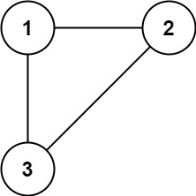
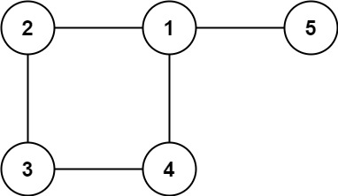

In this problem, a tree is an **undirected graph** that is connected and has no cycles.

You are given a graph that started as a tree with `n` nodes labeled from `1` to `n`, with one additional edge added. The added edge has two **different** vertices chosen from `1` to `n`, and was not an edge that already existed. The graph is represented as an array `edges` of length `n` where `edges[i] = [a_i_, b_i_]` indicates that there is an edge between nodes `a_i_` and `b_i_` in the graph.

Return _an edge that can be removed so that the resulting graph is a tree of_ `n` _nodes_. If there are multiple answers, return the answer that occurs last in the input.


**Example 1:**



```
Input: edges = [[1,2],[1,3],[2,3]]
Output: [2,3]
```


**Example 2:**



```
Input: edges = [[1,2],[2,3],[3,4],[1,4],[1,5]]
Output: [1,4]
```


**Constraints:**

-   `n == edges.length`
-   `3 <= n <= 1000`
-   `edges[i].length == 2`
-   `1 <= a_i_ < b_i_ <= edges.length`
-   `a_i_ != b_i_`
-   There are no repeated edges.
-   The given graph is connected.
