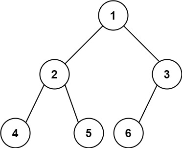

Given the `root` of a **complete** binary tree, return the number of the nodes in the tree.

According to **[Wikipedia](http://en.wikipedia.org/wiki/Binary_tree#Types_of_binary_trees)**, every level, except possibly the last, is completely filled in a complete binary tree, and all nodes in the last level are as far left as possible. It can have between `1` and `2<sup>h</sup>` nodes inclusive at the last level `h`.

Design an algorithm that runs in less than `O(n)` time complexity.

**Example 1:**



```
Input: root = [1,2,3,4,5,6]
Output: 6

```

**Example 2:**

```
Input: root = []
Output: 0

```

**Example 3:**

```
Input: root = [1]
Output: 1

```

**Constraints:**

-   The number of nodes in the tree is in the range `[0, 5 * 10^4]`.
-   `0 <= Node.val <= 5 * 10^4`
-   The tree is guaranteed to be **complete**.
