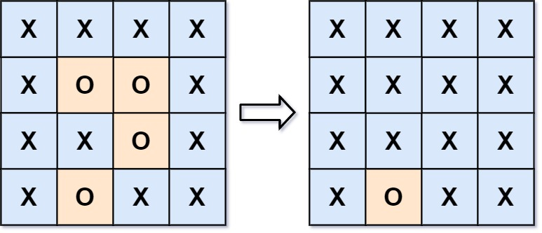

Given an `m x n` matrix `board` containing `'X'` and `'O'`, _capture all regions that are 4-directionally surrounded by_ `'X'`.

A region is **captured** by flipping all `'O'`s into `'X'`s in that surrounded region.

**Example 1:**



```
Input: board = [["X","X","X","X"],["X","O","O","X"],["X","X","O","X"],["X","O","X","X"]]
Output: [["X","X","X","X"],["X","X","X","X"],["X","X","X","X"],["X","O","X","X"]]
Explanation: Notice that an 'O' should not be flipped if:
- It is on the border, or
- It is adjacent to an 'O' that should not be flipped.
The bottom 'O' is on the border, so it is not flipped.
The other three 'O' form a surrounded region, so they are flipped.

```

**Example 2:**

```
Input: board = [["X"]]
Output: [["X"]]

```

**Constraints:**

-   `m == board.length`
-   `n == board[i].length`
-   `1 <= m, n <= 200`
-   `board[i][j]` is `'X'` or `'O'`.
