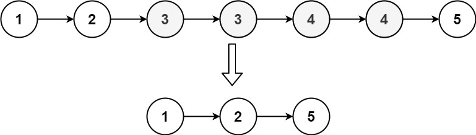
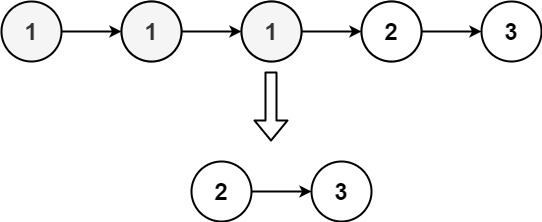

Given the `head` of a sorted linked list, _delete all nodes that have duplicate numbers, leaving only distinct numbers from the original list_. Return _the linked list **sorted** as well_.

**Example 1:**



```
Input: head = [1,2,3,3,4,4,5]
Output: [1,2,5]

```

**Example 2:**



```
Input: head = [1,1,1,2,3]
Output: [2,3]

```

**Constraints:**

-   The number of nodes in the list is in the range `[0, 300]`.
-   `-100 <= Node.val <= 100`
-   The list is guaranteed to be **sorted** in ascending order.
