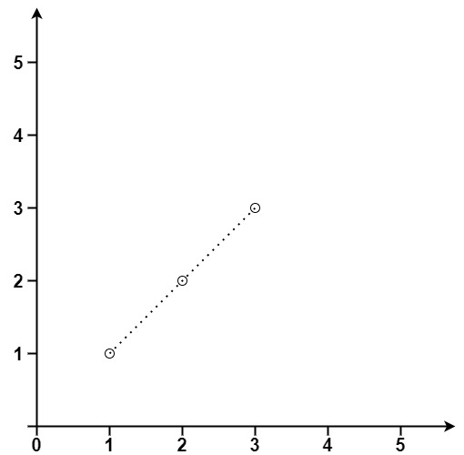
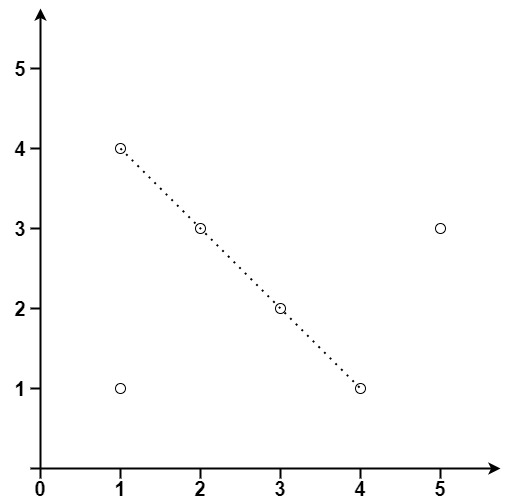

Given an array of `points` where `points[i] = [x<sub>i</sub>, y<sub>i</sub>]` represents a point on the **X-Y** plane, return _the maximum number of points that lie on the same straight line_.

**Example 1:**



```
Input: points = [[1,1],[2,2],[3,3]]
Output: 3

```

**Example 2:**



```
Input: points = [[1,1],[3,2],[5,3],[4,1],[2,3],[1,4]]
Output: 4

```

**Constraints:**

-   `1 <= points.length <= 300`
-   `points[i].length == 2`
-   `-10^4 <= x_i, y_i <= 10^4`
-   All the `points` are **unique**.
